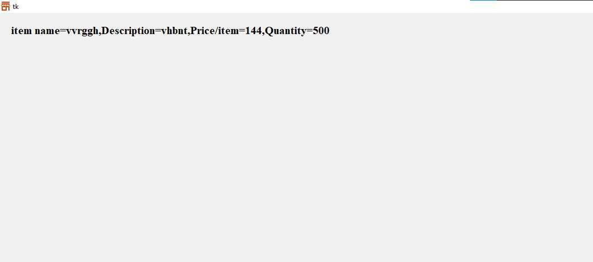
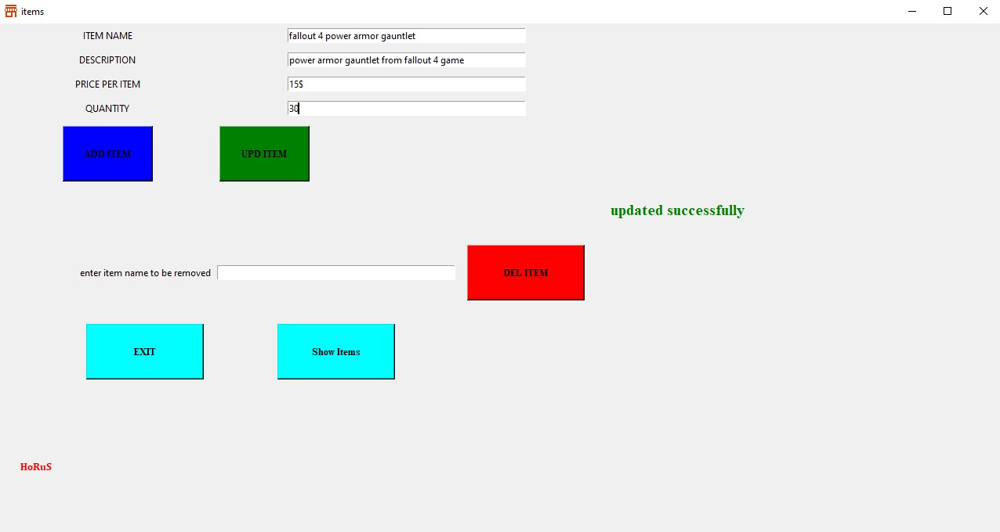

# Retail Store Inventory Management System

## Overview

This project is a **Retail Store Inventory Management System** built with **Python** and **Tkinter**. The system allows the user to manage store inventory, including adding, updating, and deleting items. It features a simple GUI for ease of interaction and includes functionalities for tracking item names, descriptions, prices, and quantities.

### Key Features:
- **Item Management**: Add, update, or delete items in the store inventory.
  - **Add Item**: Allows users to input item name, description, price per item, and quantity.
  - **Update Item**: Update existing items based on item name.
  - **Delete Item**: Remove an item by specifying its name.
  
- **Inventory Information**: The system displays the item details such as name, description, price, and quantity.

- **Music Integration**: Background music plays during the session, enhancing the user experience.

### Functionality:
1. **Add Items**: Users can add new items to the inventory, ensuring no duplicate items are added.
2. **Update Items**: Users can modify existing items' details, such as price or quantity.
3. **Delete Items**: Users can remove items from the inventory by entering the item name.
4. **File Handling**: The inventory data is stored in a text file, ensuring persistent data storage.
5. **User Interface**: A simple, intuitive interface is created using Tkinter for ease of use.

### Requirements:
- Python 3.x
- Tkinter (for GUI)
- Pygame (for music)
- Text File for data storage

<h2 style="color:red">Application Tour</h2>

### Main Menu

### Current Inventory Items

### Add Items to inventory 

### Update Items in inventory 

### Remove Items from inventory 

 
